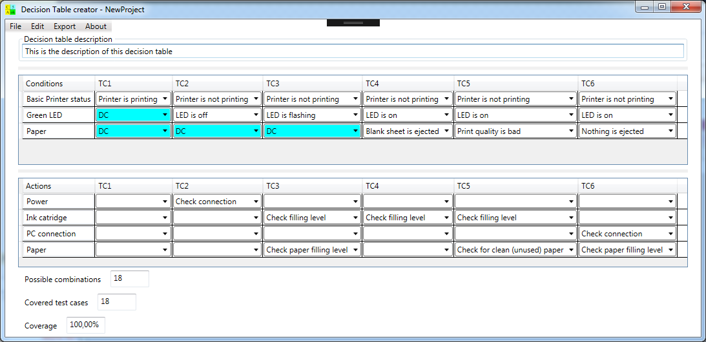

#Decesion Table Creater
##Main features

- Define conditions with more than 2 states
- Define don't care entries in conditions 
- Customizable code generator
- Calculation of possible combinations and coverage

##Menu description

###File - New
Create a new project
###File - Open
Open an existing project
###File - Save / Save as
Save the current project
###File - Create sample project
Create the printer trubbleshooting sample
###File - Exit
Exit tool

###Edit - Append test case / Delete test case
Add and delete test case

##Conditions
###Edit - Edit condition / Edit action (or double click on condition or action name)  
edit conditioon or action  
###Edit - Append condition / Insert condition 
Add or insert new condition - the edit condition dialog box appears
###Edit condition dialog

####Condition name
The name of the condition. This name will be displayed in the main window in the conditions column.
####Condition enum items
#####Name
The name of the condition enum item. This name will be displayed in the test case column.
#####Value
The value of the condition enum item. The value is used for code generation.
#####IsInvalid
This check box mark this enum item as an invalid choice. It will be displayed with a diffrent color. In combination with "Is default" this will be the default enum item. An enum value with IsInvalid is not included in the coverage calculation.
#####Don't care
This check box mark this enum item as an don't care for this test case. This is included in the coverage calculation and reduces count of needed test cases.
#####Is default
This check box mark this enum item an the default item. This means that this is the default value if a new text case is added. If more than one enum item have the default flag, the first default enum item becomes the default enum item. If none of the enum items have a default flag, the first enum item becomes the default enum item.  

##Actions
###Edit - Delete action / Delete condition
Delete condition or action - the condition or action must be selected
###Edit - Move up / Move down
Move condition or action one line up or down - the condition or action you want to move must be selected
###Edit action dialog

####Action name
The name of the action. This name will be displayed in the main window in the actions column.
####Action enum items
#####Name
The name of the action enum item. This name will be displayed in the test case column.
#####Value
The value of the action enum item. The value is used for code generation.
#####IsInvalid
This check box mark this enum item as an invalid choice. It will be displayed with a diffrent color. In combination with "Is default" this will be the default enum item.
#####Is default
This check box mark this enum item an the default item. This means that this is the default value if a new text case is added. If more than one enum item have the default flag, the first default enum item becomes the default enum item. If none of the enum items have a default flag, the first enum item becomes the default enum item.  

###Export - Export to clipboard
copy the current decision table to clipbord
use this to export the table to a word processing or spreadsheet tool 
###Export - External template - Sample.file.stg
The templates for code generation are locaten in the directory "MyDocuments"/DecisionTableCreatorTemplates/*.stg
The first template "Sample.file.stg" is written to this directory during first start of the tool. This is the place to store other templates. During the start of the tool a submenu entry is created for every template in this directory. A template must have the extension "stg".

##Code generation
The code generation is based on StringTemplate [https://github.com/antlr/stringtemplate4](https://github.com/antlr/stringtemplate4)

Further documentation: 
[StringTemplate cheat sheet](https://github.com/antlr/stringtemplate4/blob/master/doc/cheatsheet.md "https://github.com/antlr/stringtemplate4/blob/master/doc/cheatsheet.md")

###Template
A valid template must be stored in the template directory "MyDocuments"/DecisionTableCreatorTemplates/ and must end with .stg
The root entry must be **TestCasesRoot**(**root**) ::= "..."

###Object model
The following list ob objects are available for code generation.
The root object supports the interface ITestCasesRoot

    public interface ITestCasesRoot
    {
        ObservableCollection<TestCase> TestCases { get; }
        ObservableCollection<ConditionObject> Conditions { get; }
        ObservableCollection<ActionObject> Actions { get; }
    }

    public interface ITestCase
    {
        String Name { get; }
        ObservableCollection<ValueObject> Conditions { get; }
        ObservableCollection<ValueObject> Actions { get; }
    }

    public interface IConditionActionObject
    {
        string Name { get; }
        IList<ValueObject> TestValues { get; }
        Background Background { get; }
        ObservableCollection<EnumValue> EnumValues { get; }
    }

    public interface IValueObject
    {
        ObservableCollection<EnumValue> EnumValues { get; }
        Background Background { get; }
        object Value { get; }
    }

    public interface IEnumValue
    {
        string Name { get; }
        String Value { get; }
        bool IsDefault { get; }
        bool IsInvalid { get; }
        bool DontCare { get; }
    }

    public interface IBackground
    {
        BackgroundColor BackgroundColor { get; }
        string HtmlColor { get; }
    }
